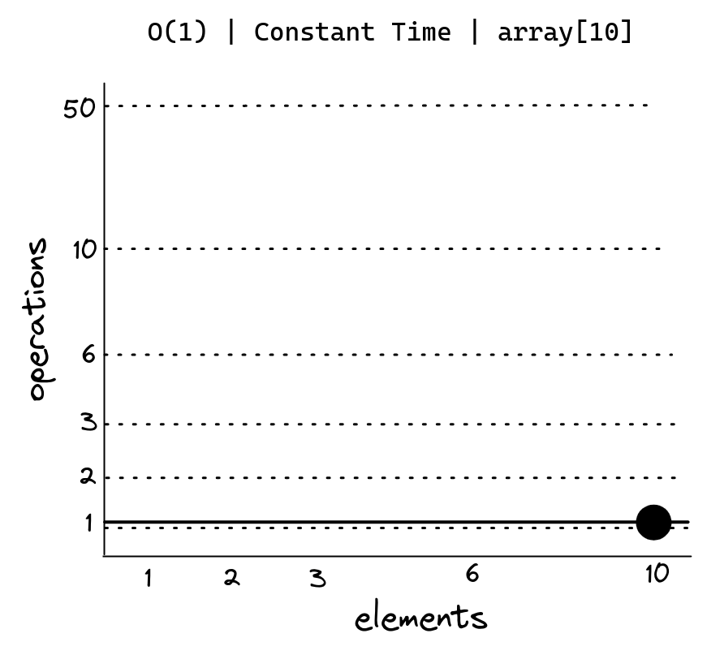

# O(1) Constant Time

O(1) é o melhor caso de complexidade de tempo. Isso significa que o algoritmo sempre executará em tempo constante, independentemente do tamanho da entrada.

Não importa se o input tem 1 ou 10.000 elementos, o algoritmo sempre executará em tempo constante, mantendo a mesma previsibilidade. 

```js
const array = [1, 2, 3, 4, 5, 6, 7, 8, 9, 10];

function first(arr) {
  return arr[10]; // O(1)
}
```



Mas, se tivermos dois acessos na mesma função, o tempo de execução será proporcional ao número de acessos. Ainda é um tempo constante, mas não mais O(1) e sim do número de operações.

```js
const array = [1, 2, 3, 4, 5, 6, 7, 8, 9, 10];

function sum(arr) {
  return arr[3] + arr[10]; // O(2)
}
```

