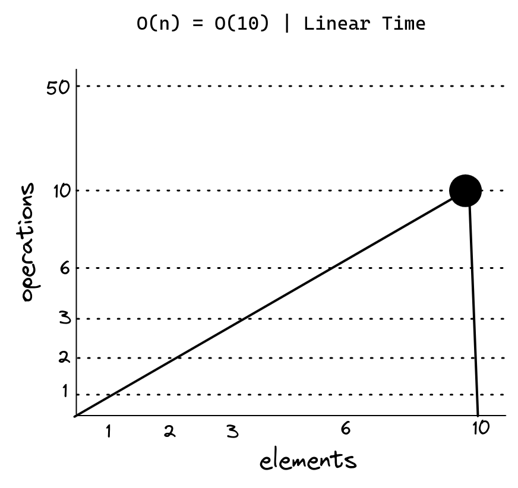

# O(n)

A complexidade assintótica O(n) é uma função que cresce linearmente com o tamanho da entrada. Ou seja, se N é 5 então a complexidade é 5. Se N é 10 então a complexidade é 10. Se N é 1000 então a complexidade é 1000.

No melhor caso, onde a entrada é um array vazio ou com um único elemento, o algoritmo executará em tempo constante O(1). No pior caso, onde a entrada é um array com N elementos, o algoritmo executará em tempo linear O(n).

```js
function sum(arr) { // O(1)
  let sum = 0; // O(1)
  for (let i = 0; i < arr.length; i++) { // O(n)
    sum += arr[i]; // O(1)
  }
  return sum; // O(1)
}
```



---

# O(2n) | O(3n) etc...

O(2n) representa uma complexidade de tempo linear, onde o tempo de execução do algoritmo cresce em função de n. Podemos simplificar isso em O(n) eliminando a constante 2.

```js
function anotherFunChallenge(input) {
  let a = 5; // O(1)
  let b = 10; // O(1)
  let c = 50; // O(1)
  for (let i = 0; i < input; i++) { // O(n)
    let x = i + 1; // O(n)
    let y = i + 2; // O(n)
    let z = i + 3; // O(n)
  }

  for (let j = 0; j < input; j++) { // O(n)
    let p = j * 2; // O(n)
    let q = j * 2; // O(n)
  }

  let whoAmI = "I don't know"; // O(1)
}

// O(n) + O(n) = (2n) - Linear time

// O(4) + O(4n) + O(3n)
// O(4n) + O(3n)
// O(n) + O(n) - drop constants
// O(2n) - Exponential time
```

5 elements in the array, 2*5 = 10 operations